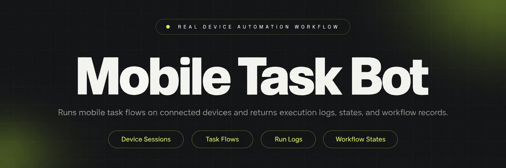
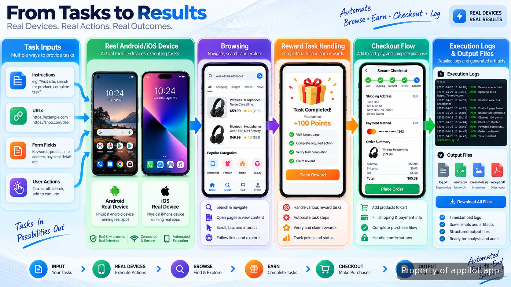

<p align="center">
  <a href="https://www.appilot.app" target="_blank" rel="nofollow">
    
  </a>
</p>

## temu bot

temu bot is a reference repository for running shopping activity flows on physical Android and iOS devices. The project shows how a device-driven automation layer can browse product pages, complete reward-related tasks, move through checkout screens, and record execution results while keeping interaction timing closer to normal app usage.

> A reference implementation for mobile task execution on real devices.

The repository focuses on the mechanics behind real device automation rather than a packaged consumer script. It separates device control, workflow steps, task state, and output handling so developers can understand where each responsibility belongs. The approach avoids emulator-only assumptions and demonstrates a structure that can be adapted for controlled testing environments.

<a href="https://www.appilot.app" target="_blank" rel="nofollow">
  
</a>

<p align="center">
  <a href="https://t.me/Bitbash333" target="_blank" rel="nofollow">
    
  </a>&nbsp;
  <a href="https://wa.me/923249868488?text=Hi%2C%20I%27m%20interested." target="_blank" rel="nofollow">
    
  </a>&nbsp;
  <a href="mailto:hello@appilot.app" target="_blank" rel="nofollow">
    
  </a>&nbsp;
  <a href="https://www.appilot.app" target="_blank" rel="nofollow">
    
  </a>
</p>



## Real Device Automation Workflow

Automation that depends on mobile applications often fails when it only models browser clicks or emulator behavior. This project uses physical devices as the execution layer, allowing interactions to happen through the same touch, screen, and application environment a person would use. The repository separates the run into input handling, device connection, action execution, and result capture.

A typical run begins with a configured device session. The controller loads a task definition, opens the application flow, navigates through required screens, and records each completed action. For example, a run may store the selected task type, the sequence of screens visited, and the final state returned by the application. The logging layer helps identify where a flow stopped instead of only showing a failed result.

## Core Features

| Feature | Description |
| --- | --- |
| Physical Device Execution | The problem of emulator-only behavior is reduced by running actions on connected Android or iOS hardware through device control layers. |
| Shopping Flow Navigation | The system handles defined application paths such as browsing screens, task pages, and checkout-related steps without requiring manual screen changes. |
| Reward Task Handling | Repeated task sequences can be represented as workflows with individual states, making completed and incomplete actions easier to inspect. |
| Natural Pace Controls | The workflow includes timing controls between actions so runs do not rely on instant scripted transitions. |
| Execution Logging | Debugging becomes simpler by capturing task progress, device responses, and generated run records. |
| Mobile Workflow Separation | Maintenance is easier because device control, task logic, and output generation are kept in separate components. |

## Mobile Automation Stack

The project uses common mobile automation concepts rather than relying on a browser-only approach. Device communication follows patterns used by frameworks such as <a href="https://appium.io/docs/en/latest/" target="_blank" rel="nofollow">Appium</a>, which supports automated interaction with mobile applications. Android workflows can be connected through the <a href="https://developer.android.com/docs" target="_blank" rel="nofollow">Android developer platform</a>, while iOS device handling follows patterns documented by <a href="https://developer.apple.com/documentation/" target="_blank" rel="nofollow">Apple developer resources</a>.

| Layer | Implementation Role |
| --- | --- |
| Mobile Driver | Connects automation commands to physical devices and application sessions. |
| Workflow Engine | Stores ordered actions, checks state changes, and manages task progression. |
| Configuration Files | Defines device targets, task parameters, and runtime settings. |
| Logging Layer | Writes execution details for troubleshooting and review. |

The architecture follows a practical separation: device access handles the phone, workflow orchestration handles the sequence, and reporting handles what happened. Developers familiar with <a href="https://opentelemetry.io/docs/" target="_blank" rel="nofollow">OpenTelemetry concepts</a> can recognize the same general idea of collecting execution context around automated actions.

## Project Layout

```text
temu-device-automation/
├── src/
│   ├── device/
│   │   ├── controller.py
│   │   └── session.py
│   ├── workflows/
│   │   ├── browse_flow.py
│   │   └── checkout_flow.py
│   ├── tasks/
│   │   └── reward_tasks.json
│   └── reports/
│       └── run_logger.py
├── config/
│   └── devices.yaml
├── requirements.txt
└── README.md
```

<a href="https://tally.so/r/yP5oDx?platform=GitHub&amp;format=Product+repo&amp;brand=Appilot&amp;niche=appilot&amp;page=Temu+Bot+on+Android%2FiOS+Devices&amp;date=2026-09-05" target="_blank" rel="nofollow">
  
</a>

## Android Automation and iOS Automation Setup

The setup assumes a developer has the project files, supported mobile hardware, and the required automation dependencies installed. Physical device access must be configured before running workflows because the execution layer depends on connected phones rather than simulated screens.

```bash
git clone repository-url
cd temu-device-automation
pip install -r requirements.txt
python src/device/controller.py
```

## How to Complete Shopping Tasks Using temu bot

- **STEP 1 — Download & Set Up the Project** Download and install temu bot from the repository source, then prepare dependencies and connect the target mobile device.
- **STEP 2 — Connect Device Session** Open the controller and establish a session with the configured Android or iOS device.
- **STEP 3 — Select Workflow Inputs** Choose task definitions, device settings, and workflow parameters from the configuration files.
- **STEP 4 — Run and Review Output** Start the execution command, then inspect logs and generated run records.

## Use Cases

- Mobile automation researchers can study how physical device actions are organized across browsing, task completion, and reporting stages.
- QA engineers can use the structure as a reference for building repeatable application interaction tests on connected phones.
- Automation developers can separate device control from business rules when creating controlled mobile workflow systems.
- Engineering teams evaluating device farm approaches can examine how multiple execution components can be organized around mobile sessions.

## Workflow Orchestration and Outputs

The workflow layer is the main coordination point. Instead of placing every action into one script, the repository represents activities as ordered steps with checkpoints. This makes it possible to inspect whether a device connected correctly, whether a screen transition completed, or whether the final output was generated.

A completed execution produces records that describe what happened during the run. A developer can compare timestamps, action sequences, and completion states when reviewing behavior. The repository does not attempt to hide uncertainty: mobile interfaces change, account states differ, and automation results depend on the application environment at execution time.

## Responsible Use Notes

Automating account activity on third-party shopping platforms may not align with platform terms or usage rules. This repository demonstrates an architectural approach for studying real device automation patterns only. Anyone adapting the structure should review the applicable platform policies and use automation in permitted environments.

## Example Command Flow

A minimal run follows a predictable sequence: prepare the device, load configuration, start the controller, execute the selected workflow, and inspect the resulting logs. The command below represents the type of local execution pattern used by the project.

```bash
python src/device/controller.py --config config/devices.yaml --task reward_tasks
```

The repository is designed as a technical reference for developers exploring real device automation, mobile automation patterns, and workflow orchestration. It works best as a learning foundation rather than a finished automation package.

## FAQ

### What does this repository demonstrate?

This repository demonstrates how mobile task automation can be structured around physical Android and iOS devices. It shows device sessions, workflow handling, execution logging, and output capture without presenting itself as a complete clone-ready system.

### Does this automation work with real phones instead of emulators?

Yes. The approach is based on connected physical devices rather than emulator-only execution. The device layer manages mobile sessions so workflows can interact with actual phone environments.

### Can this approach complete account activity automatically?

The architecture demonstrates automated account activity flows such as navigation, task handling, and checkout-related sequences. Actual behavior depends on application changes, device state, and the rules of the platform being automated.

### Does using this automation comply with platform rules?

Compliance depends on the platform policies and the way the automation is used. Third-party account automation may conflict with service terms, so users should review applicable rules before running automated activity.

<table>
  <tr>
    <td align="center" width="33%">
      
      <p>This scraper helped me gather thousands of posts effortlessly. The setup was fast, and exports are super clean and well-structured.</p>
      <p><b>Nathan Pennington</b><br>Marketer<br>★★★★★</p>
    </td>
    <td align="center" width="33%">
      
      <p>What impressed me most was how accurate the extracted data is. Likes, comments, timestamps — everything aligns perfectly.</p>
      <p><b>Greg Jeffries</b><br>SEO Affiliate Expert<br>★★★★★</p>
    </td>
    <td align="center" width="33%">
      
      <p>It's by far the best tool I've used. Ideal for trend tracking, competitor monitoring, and influencer insights.</p>
      <p><b>Karan</b><br>Digital Strategist<br>★★★★★</p>
    </td>
  </tr>
</table>